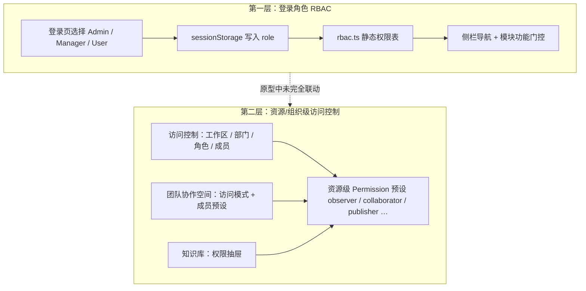
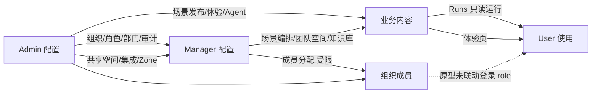

# 三角色配置与影响分析

> 说明：本原型存在 **两层权限模型**，配置方式与影响链路不同。  
> 相关文档：[`rbac.md`](./rbac.md) · [`rbac-permissions-list.md`](./rbac-permissions-list.md)

## 一、两层权限模型



| 层级 | 配置入口 | 决定什么 | 何时生效 |
|------|----------|----------|----------|
| **登录 RBAC** | 登录页选角色 + `rbac.ts` | 能否看到某导航、能否新建/发布场景等 | **登录时**确定，会话内不变 |
| **资源 ACL** | 访问控制 / 协作空间 / 知识库权限 | 某工作区、空间、知识库内谁能看/改/跑/发布 | **各模块内**配置，演示数据级 |

**重要原型限制**：Admin 在「访问控制」里改角色、加成员，**不会**自动改变用户下次登录时的 `User/Manager/Admin` 身份；登录角色与组织角色目前是**两套并行体系**。

---

## 二、Admin 如何配置 · 如何影响 Manager / User

### 2.1 访问控制（组织治理 — Admin 核心配置台）

| Admin 配置项 | 配置内容 | 对 Manager 的影响 | 对 User 的影响 |
|--------------|----------|-------------------|----------------|
| **工作区管理** | 创建工作区、邀请用户、移除成员 | Manager 可协同管理工作区成员（同权限） | User 无入口；若未来接入，决定能否进入某工作区 |
| **用户管理** | 维护平台用户列表 | Manager 可查看/管理（同权限） | 决定账号是否存在（演示层） |
| **角色管理** | **仅 Admin** 创建/编辑/删除角色及权限包 | Manager **不能**改角色定义，只能把成员挂到已有角色 | User 无入口；角色权限包设计上限定资源操作范围 |
| **部门管理** | **仅 Admin** 创建/删除/批量管理部门树 | Manager 仅可**受限编辑**部门、添加成员 | User 无入口 |
| **成员管理** | 部门树、成员激活/失效/删除、指定部门 Manager | Manager 可执行行内成员操作；**不可**删部门 Manager Protected 成员 | User 无入口 |
| **审计日志** | **仅 Admin** 查看权限变更、邀请等记录 | Manager 不可见 | User 不可见 |

**影响链路（设计意图）**：

```
Admin 定义角色权限包 → 分配给成员 → Manager 在协作空间/知识库内邀请时受权限上限约束
Admin 指定部门 Manager → 该成员在成员管理中受保护，Manager 无法删除/批量移除
```

---

### 2.2 团队协作空间

| Admin 配置项 | 对 Manager 的影响 | 对 User 的影响 |
|--------------|-------------------|----------------|
| **编辑/删除共享空间** | Manager 对共享空间**只读**，不能改 Admin 定的默认归属规则 | User 无导航入口；未指定协作空间的资源默认进共享空间（产品规则） |
| **创建/管理团队协作空间** | Manager 同样可建团队空间 | User 不可见 |
| **子级 Zone 增删改** | **仅 Admin**；Manager 只读查看 Zone | User 不可见 |
| **空间访问模式**（默认/开放/保密/共享/复制） | Admin 与 Manager 均可为团队空间选模式；复制模式继承源空间成员 | 若 User 未来接入，模式决定能否看到/进入空间 |

---

### 2.3 知识库

| Admin 配置项 | 对 Manager 的影响 | 对 User 的影响 |
|--------------|-------------------|----------------|
| **连接第三方集成**（Confluence 等） | Manager **不能**连接，需联系 IT（Admin 已连接则 Manager 可用） | User 无导航 |
| **权限分配抽屉** | Manager 可为知识库分配成员与权限 | User 无导航 |
| **上传来源** | Manager 仅本地上传；Admin 可选本地+集成 | — |
| **文档完整操作 / 上传高级设置** | Manager 文档操作受限（如仅删除） | — |

---

### 2.4 Agent 库 · 场景配置 · 应用市场 · 工具 · Skills · 分析

| 版块 | Admin 配置/产出 | 对 Manager | 对 User |
|------|-----------------|------------|---------|
| **Agent 库** | 创建/编辑/发布 Agent、高级配置 | 与 Admin **RBAC 相同** | 无入口；不直接使用 Agent 库 |
| **场景配置** | 编排工作流、发布场景 | 与 Admin 相同 | **只读列表 + Runs 运行**；不能用 Admin/Manager 发布的 Build |
| **应用市场** | 安装模板到工作区 | 与 Admin 相同 | 无入口 |
| **工具 / Skills** | 维护目录与技能 | 与 Admin 相同 | 无入口 |
| **分析** | 配置仪表盘布局、导出 | 与 Admin 相同 | 无入口 |

**Admin → User 最主要的内容传递路径**：

```
Admin/Manager 在场景配置中编排并发布 → User 在场景详情 Runs 中运行测试
Admin/Manager 在体验中维护体验入口 → User 在体验页进入 onboarding 流程
```

---

## 三、Manager 如何配置 · 如何影响 User

Manager **不能**改登录 RBAC（不能把 User 账号变成 Manager），也**不能**改访问控制里的角色定义/部门结构。Manager 的配置主要体现在 **业务资源** 上。

### 3.1 访问控制（Manager 可配部分）

| Manager 配置项 | 影响 User 的方式 |
|----------------|------------------|
| 成员行内操作（激活/失效/删除） | 演示层：可改变成员状态；**部门 Manager 成员受保护**不可删 |
| 向角色添加/移除成员 | 设计层：决定某 User 是否继承某资源权限包（原型未与登录 role 联动） |
| 部门树受限编辑、添加成员 | 影响组织归属，间接影响协作范围 |
| 不可：创建角色、删部门、审计 | User 侧无直接入口 |

---

### 3.2 场景配置（Manager → User 最关键）

| Manager 配置 | User 获得什么 |
|--------------|---------------|
| 创建/编辑场景、编排工作流 | User **看不到** Build，但 Runs 跑的是 Manager 编排好的流程 |
| 发布场景 | 决定 User 列表中可见哪些可运行场景 |
| 冻结场景 | User 若进入详情，Runs 可能不可用（需激活） |
| 不可：无 `scenario.edit` 时 N/A | User 固定只有 `scenario.view` |

---

### 3.3 体验

| Manager 配置 | User 获得什么 |
|--------------|---------------|
| 创建/复制/删除体验卡片 | User 看到相同列表（体验页未做 RBAC 裁剪） |
| 维护「新员工入职」体验流 | User 进入后走同一套 onboarding 演示 |

---

### 3.4 团队协作空间

| Manager 配置 | User 获得什么 |
|--------------|---------------|
| 新建团队空间、设访问模式、邀成员 | User **当前无导航**；设计上成员才可进空间看资源 |
| 共享空间 | User 无入口；Agent/工作流未指定空间时归共享空间（Admin 维护） |

---

### 3.5 知识库 · Agent · 应用市场 · 工具 · Skills

| 版块 | Manager 配置 | User 获得什么 |
|------|--------------|---------------|
| 知识库 | 建库、上传、分配权限 | User 无导航；未来可按权限只读/检索 |
| Agent 库 | 建 Agent、挂工具与技能 | User 不直接进库；经**场景 Runs** 间接调用 |
| 应用市场 | 安装模板 | User 无入口 |
| 工具 / Skills | 维护条目 | User 无入口；经 Agent/场景间接使用 |

---

## 四、按导航版块汇总：谁配置 · 谁受影响

| 导航版块 | Admin 配置什么 | Manager 配置什么 | 如何落到 User |
|----------|----------------|------------------|---------------|
| 首页 | 无专属配置 | 无 | User 仅聊天；不用 Admin/Manager 首页 Plan/Build |
| Agent 库 | 建/改/发 Agent | 同 Admin | 无入口；经场景间接使用 |
| 场景配置 | 编排+发布 | 编排+发布 | **只读列表 + Runs** |
| 体验 | 体验卡片与流程 | 同 Admin | **完整使用**体验流 |
| 应用市场 | 装模板 | 装模板 | 无入口 |
| 知识库 | 集成+权限+全功能 | 建库+权限（无集成连接） | 无入口 |
| 工具 / Skills | 维护目录 | 维护目录 | 无入口 |
| 团队协作 | 共享空间+Zone | 团队空间+成员 | 无入口 |
| 分析 | 布局+导出 | 布局+导出 | 无入口 |
| 访问控制 | 组织全量治理 | 成员/角色分配（受限） | 无入口 |
| 侧栏历史 | — | — | 仅对话+场景历史 |

---

## 五、配置影响关系图



---

## 六、结论与产品建议

1. **User 能感知到的 Manager/Admin 配置**主要来自：**已发布的场景**（Runs）和**体验页内容**；其余模块 User 当前不可见。
2. **Admin 对 Manager 的约束**主要在：访问控制（角色/部门/审计）、共享空间与 Zone、知识库集成与文档能力。
3. **Manager 对 User 的约束**主要是：发布哪些场景、体验卡片内容；组织成员分配在 ACL 层设计上有影响，但与登录 User 角色**尚未打通**。
4. 若产品化，建议：**登录 role** 与 **访问控制角色** 打通，或使用统一 Permission Service，避免两套体系分叉。

---

*以当前 `LJ-TTD-0618-2` 分支代码为准。*
